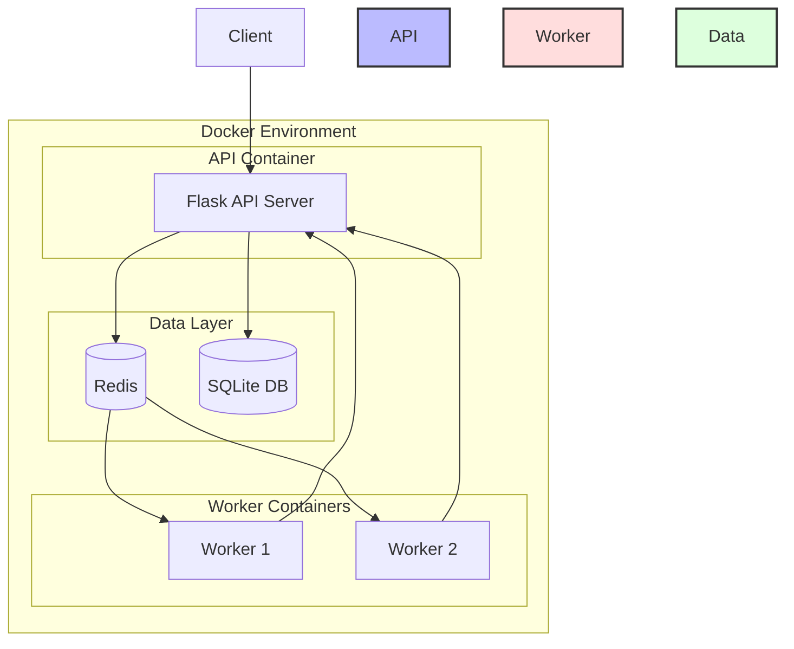
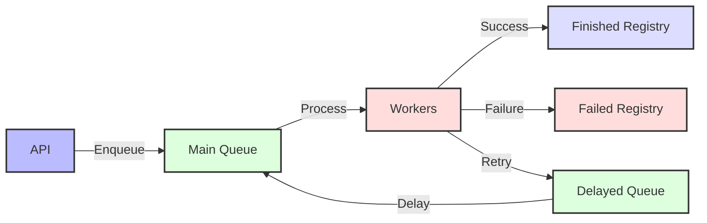

# SimpliSmart Deployment Manager

A smart deployment management system that handles resource allocation and scheduling across multiple clusters with priority-based preemption.

## High-Level Design

### Container Architecture



### Service Architecture

The system runs as a set of containerized services managed by Docker Compose:

1. **API Server Container**
   - Runs the Flask application
   - Handles all HTTP requests
   - Manages database operations
   - Enqueues jobs to Redis
   - Volume mounted: `/data` for SQLite database

2. **Worker Containers (2 instances)**
   - Process deployment requests from queue
   - Communicate with API for updates
   - Run scheduling algorithms
   - Handle preemption logic
   - Volume mounted: `/data` for database access

3. **Redis Container**
   - Manages job queues
   - Handles distributed locking
   - Queues:
     - `deployments`: Main job queue
     - Started/Finished/Failed job registries
     - Deferred jobs for delayed processing
   - Port: 6379

4. **Shared Data Layer**
   - SQLite Database:
     - Persistent storage
     - Shared via Docker volume
     - Location: `/data/app.db`
   - Redis Storage:
     - In-memory queue storage
     - Job status tracking
     - Distributed locks

### Queue Architecture



### Data Flow

1. **Deployment Creation**
   - Client sends deployment request to API
   - API validates and stores in database
   - Job enqueued to Redis queue
   - Workers pick up job for processing

2. **Scheduling Process**
   - Worker fetches deployment details
   - Acquires cluster lock via Redis
   - Checks resource availability
   - Updates deployment status via API
   - Releases cluster lock

3. **Preemption Flow**
   - Higher priority deployment arrives
   - Scheduler identifies preemptible deployments
   - Updates status of affected deployments
   - Re-queues preempted deployments with delay
   - Updates new deployment status

### Scalability & Reliability

- **Multiple Workers**: Two worker containers for parallel processing
- **Distributed Locking**: Prevents race conditions in scheduling
- **Automatic Retries**: Failed jobs are automatically retried
- **Delayed Processing**: Preempted jobs are re-queued with delay
- **Transaction Management**: ACID compliance for database operations
- **Queue Monitoring**: Track job status and queue health

### Docker Compose Configuration

```yaml
services:
  app:
    build: .
    ports:
      - "6000:6000"
    volumes:
      - ./data:/data
    depends_on:
      - redis

  worker:
    build: .
    command: python worker.py
    volumes:
      - ./data:/data
    depends_on:
      - redis
      - app
    deploy:
      replicas: 2

  redis:
    image: redis:latest
    ports:
      - "6379:6379"
```

## System Architecture


## Deployment Workflow


## Features

- **Multi-Cluster Support**: Manage deployments across multiple clusters
- **Priority-Based Scheduling**: Higher priority deployments can preempt lower priority ones
- **Resource Management**: Efficient allocation of CPU, RAM, and GPU resources
- **Role-Based Access Control**: Admin and Developer roles with different permissions
- **Queue Management**: Redis-based queuing system with automatic retries
- **Distributed Locking**: Prevent race conditions in scheduling decisions

## Components

### API Server
- Flask-based REST API
- JWT Authentication
- Role-based access control
- Database operations via SQLAlchemy

### Scheduler
- Resource allocation algorithms
- Priority-based preemption
- Distributed locking with Redis
- Transaction management

### Worker
- Processes deployment requests from queue
- Handles scheduling attempts
- Automatic retries with delays
- Error handling and logging

### Queue Service
- Redis-based job queue
- Job status tracking
- Delayed job processing
- Multiple worker support

## API Documentation

### Authentication

#### Login
```bash
curl -X POST http://localhost:6000/auth/login \
  -H "Content-Type: application/json" \
  -d '{
    "email": "admin@test.com",
    "password": "admin123"
  }'
```

#### Register
```bash
curl -X POST http://localhost:6000/auth/register \
  -H "Content-Type: application/json" \
  -d '{
    "email": "user@test.com",
    "password": "password123",
    "invite_code": "INVITE_CODE"
  }'
```

### Invites

#### Create Invite (Admin Only)
```bash
curl -X POST http://localhost:6000/invites/ \
  -H "Authorization: Bearer TOKEN" \
  -H "Content-Type: application/json" \
  -d '{
    "email": "newuser@test.com",
    "role": "dev"
  }'
```

### Deployments

#### Create Deployment
```bash
curl -X POST http://localhost:6000/deployments/ \
  -H "Authorization: Bearer TOKEN" \
  -H "Content-Type: application/json" \
  -d '{
    "name": "test-deployment",
    "cluster_id": 1,
    "ram": 4,
    "cpu": 2,
    "gpu": 0,
    "priority": 3
  }'
```

#### List Deployments
```bash
curl -X GET http://localhost:6000/deployments/ \
  -H "Authorization: Bearer TOKEN"
```

## Setup

1. Install dependencies:
```bash
pip install -r requirements.txt
```

2. Set up environment variables:
```bash
cp .env.example .env
# Edit .env with your configuration
```

3. Initialize database and test data:
```bash
python -c "from app.utils.init_test_data import init_test_data; init_test_data()"
```

4. Start services:
```bash
docker-compose up
```

## Development

### Database Models
- `Organisation`: Represents an organization
- `User`: User accounts with roles
- `Cluster`: Resource clusters with capacity
- `Deployment`: Deployment requests with resources and priority
- `InviteCode`: Invitation system for new users

### Key Services
- `DeploymentService`: Manages deployment lifecycle
- `SchedulerService`: Handles resource allocation
- `QueueService`: Manages job queue
- `AuthService`: Handles authentication
- `InviteService`: Manages invite system

## Testing

Run the test suite:
```bash
python -m pytest tests/
```

## Environment Variables

- `JWT_SECRET_KEY`: Secret key for JWT tokens
- `FLASK_APP`: Flask application entry point
- `FLASK_ENV`: Environment (development/production)
- `REDIS_HOST`: Redis server hostname
- `REDIS_PORT`: Redis server port
- `DATABASE_PATH`: SQLite database path

## Deployment Priority Levels

1. `LOWEST` (1): Lowest priority, first to be preempted
2. `LOW` (2): Low priority deployments
3. `MEDIUM` (3): Default priority level
4. `HIGH` (4): High priority deployments
5. `HIGHEST` (5): Highest priority, can preempt others

## Error Handling

The system uses custom exceptions:
- `ValidationError`: Input validation errors
- `AuthenticationError`: Authentication failures
- `AuthorizationError`: Permission issues
- `ServiceException`: General service errors


